# Registro de errores y soluciones

Este documento registra los principales errores encontrados durante el desarrollo del proyecto de comparación de herramientas MLOps utilizando **MLflow** y **Weights & Biases (W&B)**.

El objetivo es mantener evidencia de los problemas encontrados, identificar su causa y documentar la solución aplicada.

---

## Error 1: MLflow no estaba disponible en el entorno

### Descripción

Al ejecutar el notebook e intentar importar MLflow se produjo el siguiente error:

```text
ModuleNotFoundError: No module named 'mlflow'
```

### Evidencia

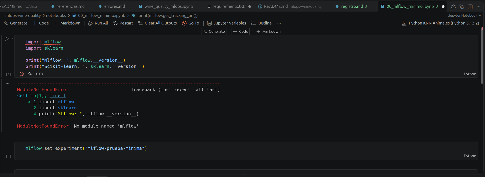

### Causa

El kernel seleccionado en Jupyter no tenía disponible la librería MLflow.

Esto puede ocurrir cuando el paquete no está instalado en el entorno virtual utilizado por el notebook o cuando se selecciona un intérprete diferente al entorno del proyecto.

### Solución

Se verificó el entorno virtual utilizado por el proyecto y se instaló MLflow dentro del mismo entorno.

También se comprobó que VS Code utilizara el kernel correspondiente al entorno `.venv` del proyecto.

---

## Error 2: Dependencia `ucimlrepo` no instalada

### Descripción

Al intentar importar la función utilizada para obtener el dataset desde UCI Machine Learning Repository:

```python
from ucimlrepo import fetch_ucirepo
```

se obtuvo:

```text
ModuleNotFoundError: No module named 'ucimlrepo'
```

### Evidencia

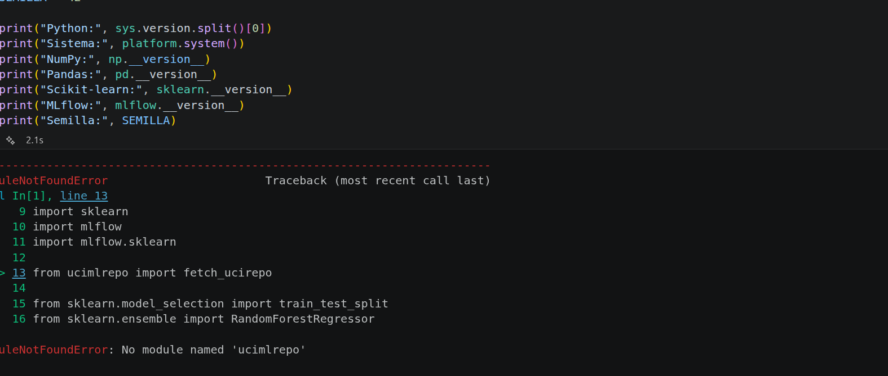

### Causa

La librería `ucimlrepo`, utilizada para obtener el dataset **Wine Quality** desde UCI Machine Learning Repository, no estaba instalada en el entorno virtual.

### Solución

Se instaló la dependencia directamente desde el notebook mediante:

```python
%pip install ucimlrepo
```

Después de la instalación, el paquete quedó disponible dentro del entorno virtual utilizado por Jupyter.

### Evidencia de la solución

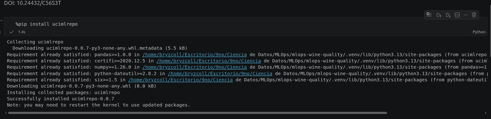

---

## Error 3: MLflow y Skops detectan tipos no confiables

### Descripción

Durante el registro del modelo Random Forest con:

```python
mlflow.sklearn.log_model(
    sk_model=modelo,
    name="random_forest"
)
```

se produjo la excepción:

```text
UntrustedTypesFoundException:
Untrusted types found in the file:
['sklearn.tree._tree.Tree']
```

Posteriormente, MLflow generó una `MlflowException` relacionada con el mismo problema.

### Evidencia

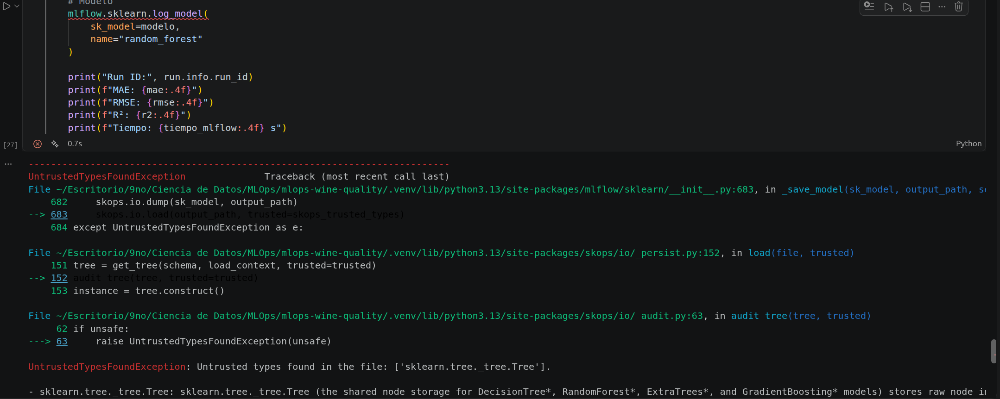

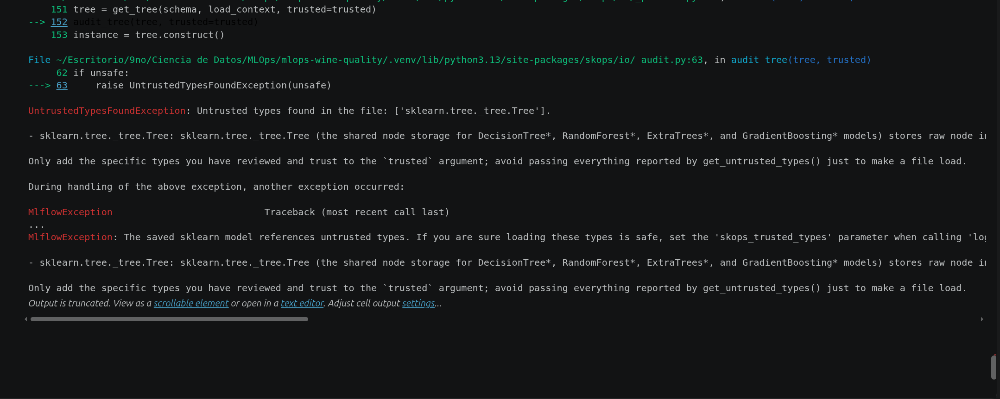

El problema apareció durante la ejecución de:

```python
mlflow.sklearn.log_model(
    sk_model=modelo,
    name="random_forest"
)
```

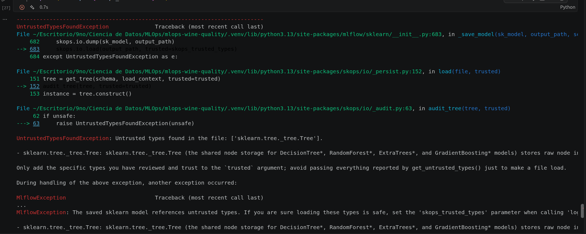

### Causa

Durante el proceso de serialización del modelo, Skops realizó una validación de seguridad y detectó el tipo interno:

```text
sklearn.tree._tree.Tree
```

como un tipo que no había sido marcado explícitamente como confiable.

El problema apareció debido a que el modelo **Random Forest** utiliza internamente estructuras de árboles de decisión.

### Solución

Se revisó la compatibilidad entre las versiones utilizadas de MLflow, Scikit-learn y sus mecanismos de serialización.

Para continuar con los experimentos se ajustó la estrategia utilizada para registrar el modelo y las dependencias del entorno.

Este error permitió identificar la importancia de controlar las versiones y mecanismos de serialización de los modelos dentro de un flujo MLOps reproducible.

---

## Error 4: Longitud inválida del `digest` del dataset en MLflow

### Descripción

Al intentar registrar el dataset como entrada de una ejecución mediante:

```python
mlflow.log_input(
    dataset_mlflow,
    context="training"
)
```

MLflow produjo el siguiente error:

```text
MlflowException: 'digest' exceeds the maximum length of 36 characters
```

### Evidencia

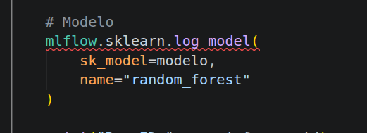

### Causa

El identificador `digest` utilizado para representar la versión del dataset excedía el límite máximo de **36 caracteres** aceptado por MLflow para este campo.

### Solución

Se modificó la forma de identificar la versión del dataset utilizando un identificador más corto que cumpliera con la restricción establecida por MLflow.

Esto permite mantener una referencia a la versión de los datos utilizados sin exceder el tamaño permitido por la herramienta.

---

## Error 5: Variables no definidas durante el versionado con W&B

Durante la implementación del versionado del dataset con **Weights & Biases** aparecieron errores relacionados con elementos que no habían sido definidos previamente en la sesión actual del notebook.

### 5.1 `wandb` no estaba definido

#### Descripción

Al ejecutar:

```python
with wandb.init(
    project="wine-quality-random-forest-artifacts",
    name="dataset-versioning",
    job_type="dataset-versioning"
):
```

se produjo:

```text
NameError: name 'wandb' is not defined
```

#### Evidencia

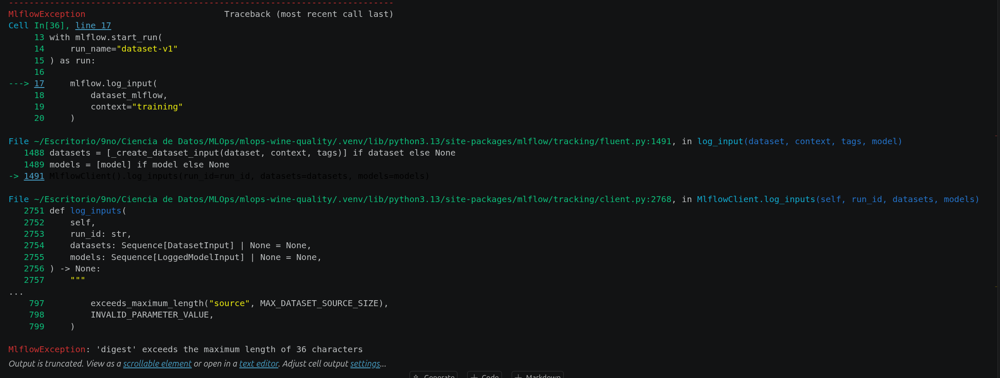

#### Causa

El nombre `wandb` no estaba definido dentro de la sesión actual del notebook.

Esto puede suceder cuando la librería no ha sido importada previamente o cuando el kernel ha sido reiniciado y las importaciones anteriores se han perdido.

#### Solución

Se agregó la importación correspondiente antes de utilizar la API de Weights & Biases:

```python
import wandb
```

---

### 5.2 `metadata_datos` no estaba definido

#### Descripción

Posteriormente, al crear el artefacto correspondiente al dataset:

```python
artefacto_datos = wandb.Artifact(
    name="wine-quality-clean",
    type="dataset",
    metadata=metadata_datos
)
```

se produjo:

```text
NameError: name 'metadata_datos' is not defined
```

#### Evidencia

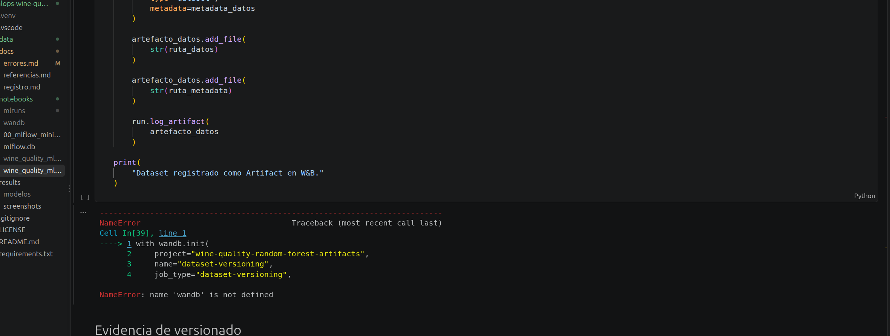

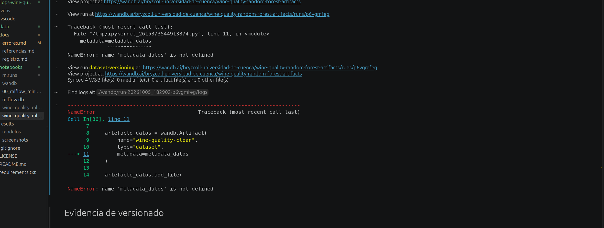

#### Causa

La variable `metadata_datos` no había sido definida en la sesión actual antes de utilizarse como argumento de `wandb.Artifact()`.

Este problema puede aparecer cuando las celdas del notebook se ejecutan fuera de orden o cuando se reinicia el kernel.

#### Solución

Se definió la metadata antes de crear el artefacto.

Por ejemplo:

```python
metadata_datos = {
    "dataset": "Wine Quality",
    "source": "UCI Machine Learning Repository"
}
```

Posteriormente, esta variable pudo utilizarse durante la creación del artefacto:

```python
artefacto_datos = wandb.Artifact(
    name="wine-quality-clean",
    type="dataset",
    metadata=metadata_datos
)
```

Esto permitió continuar con el proceso de versionado del dataset mediante W&B Artifacts.

---

## Error 6: Directorio de salida inexistente al guardar resultados

### Descripción

Al intentar guardar el ranking de experimentos de MLflow en formato CSV:

```python
ranking.to_csv(
    "../results/metrics/mlflow_experimentos.csv",
    index=False
)
```

se produjo el siguiente error:

```text
OSError: Cannot save file into a non-existent directory:
'../results/metrics'
```

### Evidencia

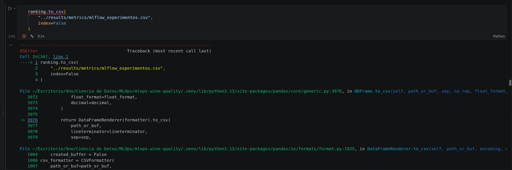

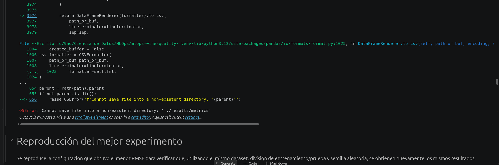

### Causa

Pandas puede crear el archivo CSV, pero no crea automáticamente los directorios que forman parte de la ruta de destino.

En el momento de ejecutar la celda, la ruta:

```text
../results/metrics
```

no existía desde el directorio de trabajo utilizado por el notebook.

Por este motivo, `to_csv()` no pudo crear el archivo `mlflow_experimentos.csv`.

### Solución

Se creó previamente el directorio destinado a almacenar las métricas antes de exportar los resultados.

Por ejemplo:

```python
from pathlib import Path

ruta_metricas = Path("../results/metrics")
ruta_metricas.mkdir(parents=True, exist_ok=True)

ranking.to_csv(
    ruta_metricas / "mlflow_experimentos.csv",
    index=False
)
```

De esta manera, el notebook garantiza que el directorio exista antes de intentar escribir el archivo.

Además, esto mejora la reproducibilidad del proyecto, ya que una nueva ejecución no depende de que la estructura de carpetas haya sido creada manualmente.

---

## Error 7: Variable `tiempos_wandb` no definida

### Descripción

Durante la construcción del DataFrame utilizado para comparar los tiempos de ejecución de las diferentes alternativas se utilizó:

```python
df_benchmark = pd.DataFrame({
    "repeticion": range(
        1,
        REPETICIONES + 1
    ),
    "baseline": tiempos_baseline,
    "mlflow": tiempos_mlflow,
    "wandb": tiempos_wandb
})
```

Al ejecutar la celda se produjo:

```text
NameError: name 'tiempos_wandb' is not defined
```

### Evidencia

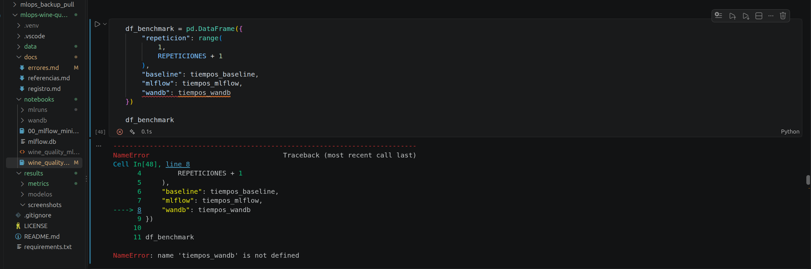

### Causa

La variable `tiempos_wandb` no estaba disponible en la sesión actual de Python cuando se intentó construir el DataFrame.

Esto puede ocurrir cuando:

- no se ha ejecutado previamente la celda que genera los tiempos de W&B;
- una ejecución anterior del benchmark de W&B terminó con un error;
- se reinició el kernel y se perdieron las variables almacenadas en memoria;
- las celdas del notebook fueron ejecutadas fuera de orden.

### Solución

Se verificó que el benchmark correspondiente a W&B se ejecutara antes de construir `df_benchmark` y que sus resultados fueran almacenados en la variable:

```python
tiempos_wandb = []
```

Posteriormente, cada tiempo obtenido durante las repeticiones del experimento se agregó a esta lista.

Una vez disponibles las tres variables:

```python
tiempos_baseline
tiempos_mlflow
tiempos_wandb
```

se pudo construir correctamente el DataFrame comparativo.

Este error evidenció la importancia de mantener un orden de ejecución claro en el notebook y de inicializar las variables necesarias antes de utilizarlas.

---

# Conclusiones

Durante el desarrollo de los experimentos con MLflow y Weights & Biases se encontraron diferentes tipos de errores que permitieron identificar aspectos importantes para la reproducibilidad de un proyecto MLOps.

Los principales problemas encontrados estuvieron relacionados con:

1. **Configuración del entorno:** algunas dependencias no estaban disponibles inicialmente en el kernel utilizado por Jupyter.

2. **Gestión de dependencias:** fue necesario instalar paquetes adicionales como `ucimlrepo` para obtener el dataset utilizado en los experimentos.

3. **Serialización de modelos:** el registro del modelo Random Forest presentó restricciones relacionadas con los tipos considerados seguros por Skops.

4. **Registro y versionado de datasets:** MLflow presentó restricciones sobre el tamaño del identificador utilizado como `digest`.

5. **Estado del notebook:** algunas variables y módulos no estaban definidos debido al orden de ejecución de las celdas o al reinicio del kernel.

6. **Gestión de archivos y directorios:** fue necesario garantizar la existencia de las carpetas antes de almacenar métricas y resultados.

7. **Benchmarking:** las variables utilizadas para comparar los tiempos de ejecución debían generarse antes de construir los resultados comparativos.

El registro de estos errores permite conservar evidencia del proceso de desarrollo y facilita la reproducción de los experimentos. Además, muestra que la reproducibilidad en MLOps no depende únicamente del modelo entrenado, sino también de las **dependencias, versiones, datos, estructura del proyecto, configuración de las herramientas y orden de ejecución del pipeline**.